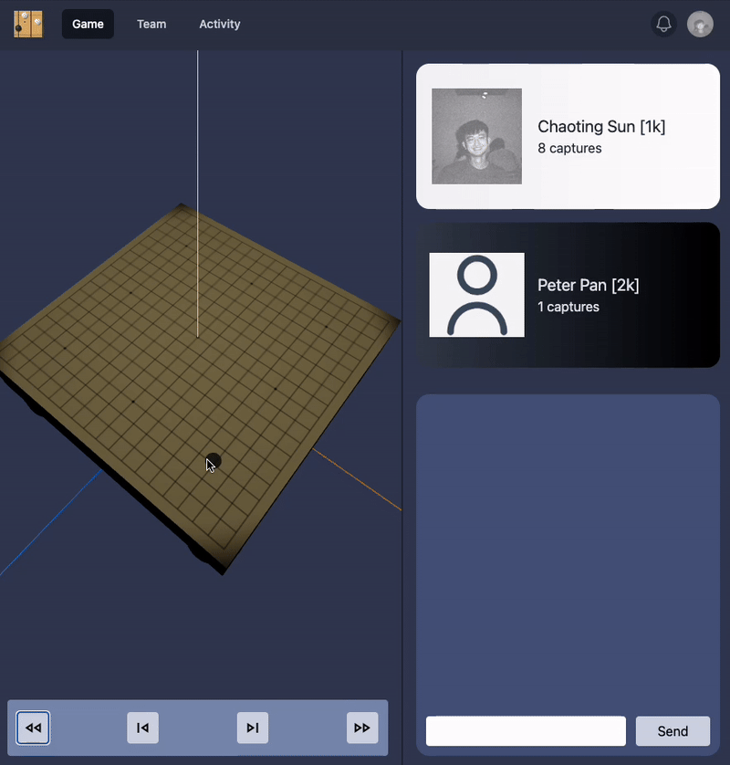

# 3D Go Game

This is a 3D go game implemented by three.js. Welcome for giving me some advices!

## Techniques

- [React](https://react.dev/)
- [TailwindCSS](https://github.com/tailwindlabs/tailwindcss) for styling
- [TypeScript](https://www.typescriptlang.org/)
- [React Three Fiber](https://github.com/pmndrs/react-three-fiber) for 3D object rendering

## Milestones

- [x] 3D view of board and stones
- [x] Go game logic
- [x] Game page
- [x] Play game based on sgf files
- [ ] Team page
- [ ] Activity page
- [ ] Authentication

## Credits

- The go-game logic is translated from [brilee - go_implementation](https://github.com/brilee/go_implementation).
- The go-game records were fetched base on [Chewt's script](https://gist.github.com/Chewt/c4a89bf1d54f27bf7e087a852b4610f9)